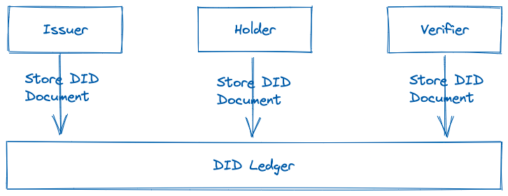
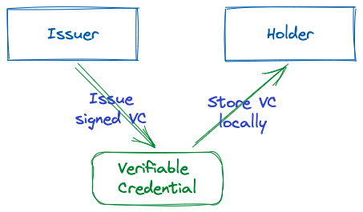
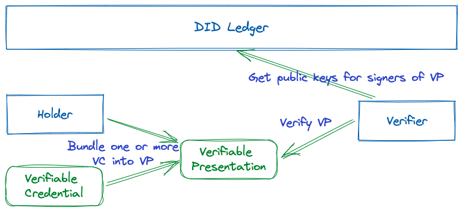
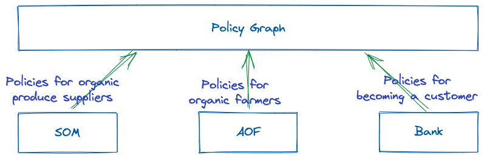

## The Trust Protocol

The basic DID functionality is to associate a key pair with an identity and store this association in a publicly accessible storage. We prefer the decentralised, immutable kind; AKA a blockchain.

Once the identities and associated keys have been stored, any DID acting as an `issuer`, can create a `verifiable credential` and send it to a `holder`. In general the holder will ask for the VC first and the issuer will respond to this request by issuing the VC.

The `holder` can then, at their leisure, create a `verifiable presentation` containing one ore more VCs and send it to an arbitrary DID which will act as the `verifier`. The verifier will access the Ledger to make sure that the keys used for signing the VCs are registered to the correct DIDs. The verifier makes sure everything is `correct`.

## The Missing link

What is missing in the DID process is a way to check that the VC was issued by the right party and even more importantly, that processes which require multiple VCs to be issued can be documented and verified in a decentralised manner.

As this is very abstract, an example would be helpful: 

> A supermarket chain, Super Organic Markets (SOM), wants to make sure that all of its organic produce is supplied by organic farmers only.
> 

The process to become a recognised organic farmer has been established as follows:

- Get certified by the Association of Organic Farmers (AOF)
    - This involves having the accounts audited every year by one of the approved auditors
    - The farmers must also pay a membership fee to the association
    - For diary farms, an annual visit by an animal welfare expert is also mandated
- Be registered with the national commerce registry (NCR)
- Have a bank account with one of the SOM’s partner banks (SPBa, SPBb and SPBc)

In order to reduce the administrative overhead, SOM has convinced all the participants to use `the Kilt protocol` to create identities and issue credentials. 

SOM has published the identities of the issuing parties (AOF, NCR and SPB?) on their website to make sure that everyone can verify the Verifiable Credentials of farmers. It also makes available a web-app which helps farmers perform the registration.

### But complexity looms

This all works well as long as there is only one supermarket chain involved. But after a year of operations, 12 other super market chains in the country find the process helpful and would like to do the same thing. 

As SOM has published the identities of the issuers on its website, in a static HTML, there is no easy way to retrieve the information programatically. On top of that, if some information changes, a manual process is required to perform the update, 12 times. Not only is the latency of change high, but the probability of someone making a mistake is even higher.

Also, because the data is published in an HTML file, there is no versioning or historic data. It is not possible to check if a VC was valid 12 months ago if it is not valid today. Unless of course the verifier has stored the history in their own system.

Also, everyone just blindly trusts the AOF to do its work properly and apply the same rules to all its members. There are many example internationally of such associations breaking their own rules. This is why the AOF has chosen to use the `Sovrin identity network` to enable its members to get transparency about who has fulfilled the criteria to be a member. But now the AOF does not issue Kilt VCs anymore.

And while the first 3 banks were willing to use the same identity system, the newest partner bank has already implemented a DID based system and is reluctant to switch.

### Help is on its way

What is missing is a system which is DID method agnostic and allows to encode the rules in a machine readable, immutable and trustworthy manner. That is what the Trust Protocol provides.

The trust protocol enables the creation of complex compliance rules based on VCs from any DID method. The rules are stored in a blockchain and constitute a `policy graph` against which every Verifiable Presentation can be checked.

The `policy graph` is versioned and contains full historiographic documentation. It is therefore always possible to answer the question: was this VC valid at the time of issuance?

> In the near future, the winners will be the organisations which are able to collaborate most efficiently. Creating publicly verifiable policy graphs is the most efficient way to build the trust relationships which are required for effective collaboration.
> 

With DIDs, users can authenticate without the need for an identity server but the authorisations are still stored in silos within the applications the users connect to. This leads to needless repeated registration and verification, adds friction to commercial processes and reduces security as one organisation can not learn from the revocations at their peers.

The verification process with the Policy Graph looks just slightly different:

## Conclusion

In any software solution that requires users to authenticate, Identity and Access Management is a mandatory feature.

The identity system of the decentralised world will be self sovereign and the solutions for this have been implemented by many. But this is only the first half of the equation, the `I`

In order to create a truly decentralised ecosystem, we also need to provide a self sovereign Access Management solution; the `A`. This is what the Trust Protocol provides:

- Identity method agnostic
- Complex policy description
- Completely decentralised with no central database
- No ACL or other user membership list
- Cryptographically secure
- Usable on-chain, off-chain and cross-chain